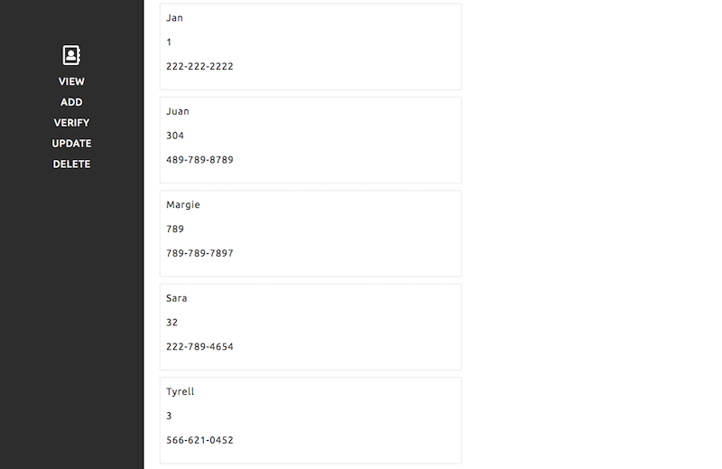
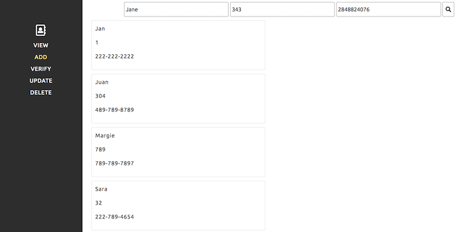
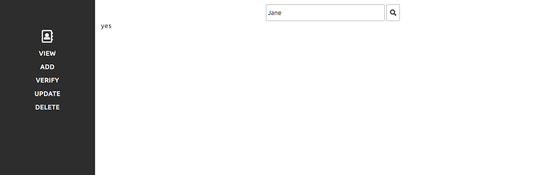

# LFL Employee Directory code challenge

For this assignment you will be building an online employee directory, using only vanilla JS (**no jQuery**).

Please fork this repository for your work, you should spend no more than 4-6h on this, please make sure to document your process in the `Dev Notes` section of this `README`

Feel free to reach out to with any questions or for clarification.

## Setup
- No dependencies needed
- Task runners are okay
- `SASS/SCSS` is okay, your choice
- `dom.js` contains some helper functions

## Requirements
#### Sidebar / main content layout is honored per screenshots

#### A `View` option that displays all employees & their info

#### An `Add` option that allows users to input a name, an office number, and a phone number

#### A `Verify` option that allows users to input a name and returns a success/error state to the UI

#### An `Update` option that allows the user to input name, office number, and phone number -- updating only the office number and phone number upon a name match

#### A `Delete` option that deletes the employee with the matching name

## Bonus
- Style all/any of the aforementioned interactions however you see fit, this is an opportunity to show off your creativity!
- MVC JS architecture

## Dev notes